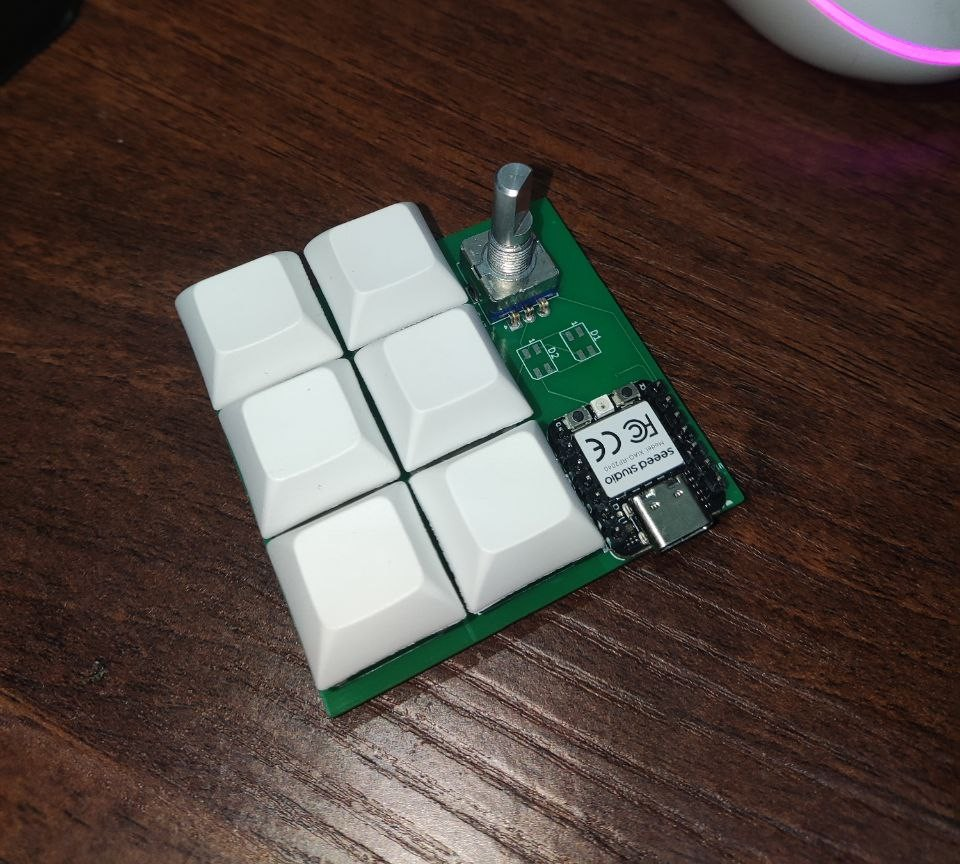
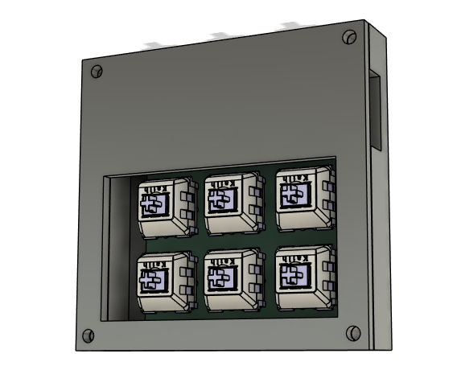
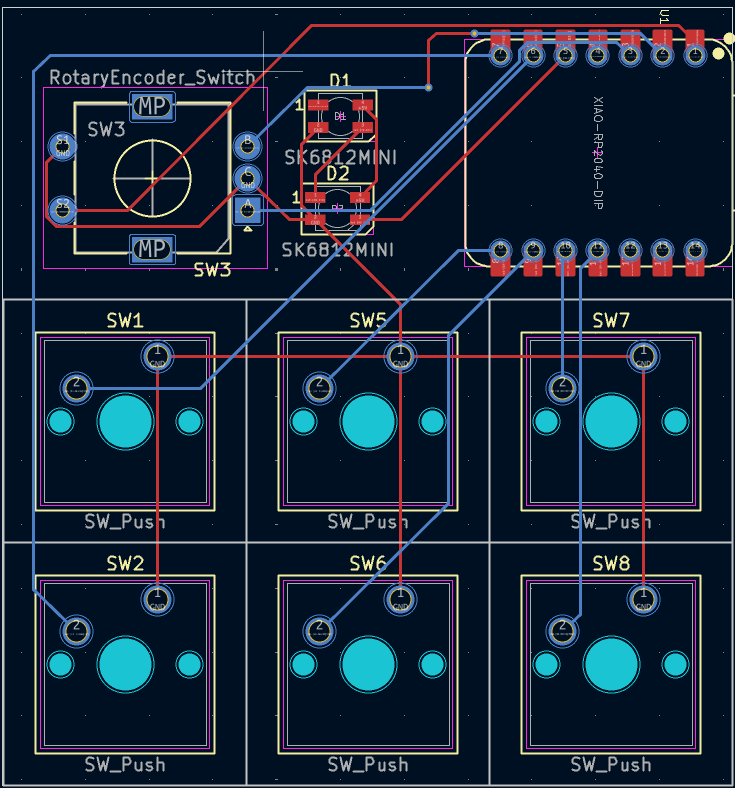
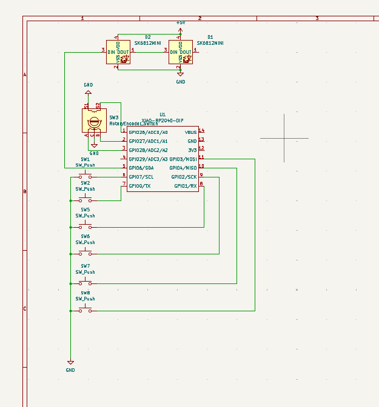

## Info

> It's just a simple macropad and i don't wanna mess it up so i kept it as it is simple and i wanna try to get this!!

> I dont wanna change or customize it i just wanna build it and see it work 

## Full Build

## Features 

> 6 switches with different functionalities (opening chrome for example)

> Rotary encoder to turn the volume up and down

## CAD Model:

## PCB

--------------------

## BOM:

Here is everything i need:

- Seeed XIAO RP2040 x1

- PCB x1

- Cherry MX switches x6

- Blank DSA keycaps x6

- SK6812 MINI Leds x2

- M3x16 Bolt x4

- M3 Heatset x4

